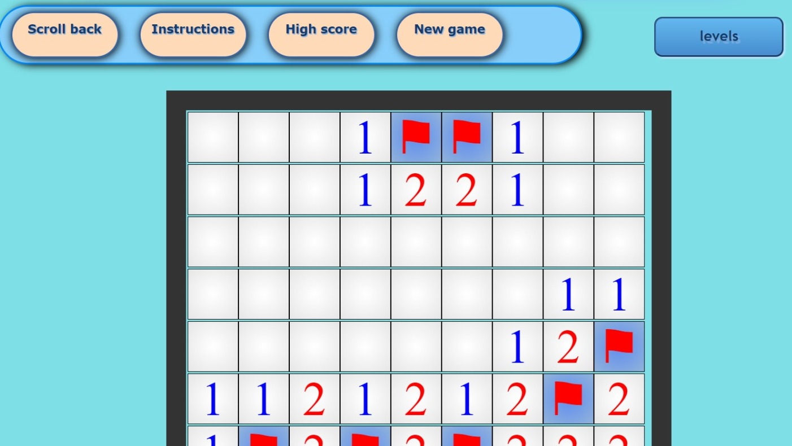

# Minesweeper
Minesweeper game with an OOP foundation and modern UI.
 Minesweeper is a classic game that has been built on the foundations of Object-Oriented Programming (OOP) principles, resulting in a robust and efficient program.
 The game features an attractive user interface that is easy to use and visually appealing. Players can enjoy the familiar gameplay of Minesweeper while experiencing modern design and functionality. The program has been thoroughly tested and optimized for performance, ensuring a smooth and enjoyable experience for players.
 {width="500px"}
